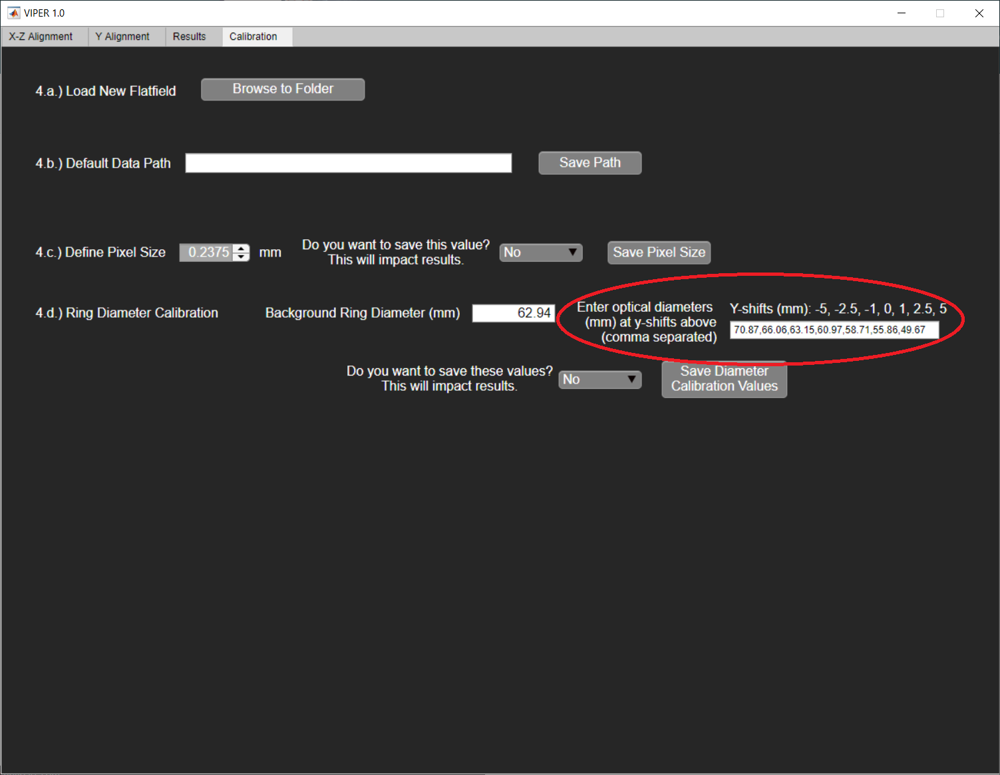

**Longitudinal Ring Calibration Procedure for VIPER System**

_Written 11/21/20 by Daniel Alexander (_[_daniel.a.alexander.th@dartmouth.edu_](mailto:daniel.a.alexander.th@dartmouth.edu)_)_

The Visual Isocenter Position Enhanced Review, or VIPER, system relies on the diameter measurement of the optical ring of Cherenkov emission generated in the phantom when irradiated with a sheet beam parallel to the X-Z plane. This diameter relative to the phantom diameter uniquely determines the Y-position of the phantom center, however it must be calibrated. This procedure is outlined below:

1. Align the phantom to isocenter using the MR imaging system. The tip of the hollow point in the conical plastic component should be aligned with [0,0,0] in the MR image.

1. Deliver the sheet beam plan to the phantom at this position (all four angles) while acquiring Cherenkov data using C-Dose research. This will produce a cumulative PNG file in the acquisition folder. (Review-\&gt;Browse to DB). If RAW files are produced, alter the C-Dose settings to &quot;Save Average Image&quot;.

1. Repeat step 2, but with longitudinal shifts of -5 mm, -2.5 mm, -1 mm, 1 mm, 2.5 mm, and 5 mm. Keep track of which image is which.

1. Use the &quot;VIPERLngCalib.m&quot; file to Analyze the images and extract the optical diameters.

1. Input these diameters in the Calibration pane of the VIPER software separated by commas.

